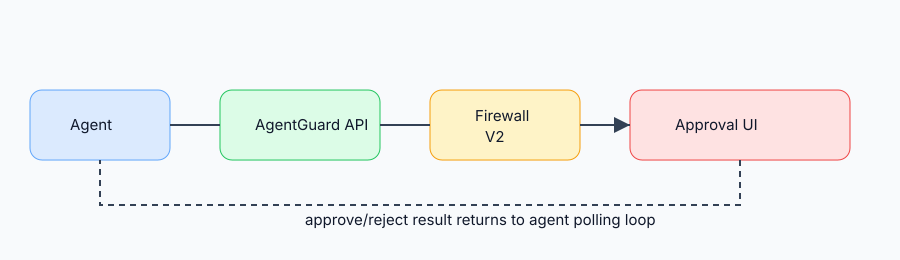

# AgentGuard

AgentGuard is an open-source runtime security and approval layer for tool-using AI agents. It intercepts proposed tool calls, evaluates them with Firewall V2, and returns `allow`, `require_approval`, or `block` before the agent executes the tool.



## Quickstart

```bash
export AGENTGUARD_API_KEY=dev-agentguard-key
docker compose up --build
```

Open:

- AgentGuard dashboard: http://127.0.0.1:5173
- API docs: http://127.0.0.1:8000/api/docs

Run the minimal SDK example:

```bash
python -m venv .venv
. .venv/bin/activate
pip install -e agentguard-product/packages/agentguard-sdk
AGENTGUARD_BASE_URL=http://127.0.0.1:8000 \
AGENTGUARD_API_KEY=dev-agentguard-key \
python examples/minimal-python-agent/main.py
```

## Repository Layout

```text
agentguard-product/              AgentGuard API, dashboard, Firewall V2, SDK, Helm chart
google-adk-personal-agent/       Google ADK example chatbot integration
examples/minimal-python-agent/   Minimal framework-neutral SDK example
docs/                            OSS user, architecture, deployment, and security docs
.github/workflows/               CI and publishing workflows
```

## Runtime Flow

```text
Agent runtime
  -> AgentGuard SDK HTTP client
  -> AgentGuard API
  -> Firewall V2: intent + Tier 1 + Tier 3 + combiner
  -> allow | require_approval | block
  -> AgentGuard approval UI if needed
  -> agent executes only after allow/approval
  -> outcome report and live SSE dashboard events
```

## Documentation

- [Quickstart](docs/quickstart.md)
- [Architecture](docs/architecture.md)
- [SDK Integration](docs/sdk-integration.md)
- [Approval Flow](docs/approval-flow.md)
- [Docker Compose Deployment](docs/deployment/docker-compose.md)
- [Kubernetes Deployment](docs/deployment/kubernetes.md)
- [Configuration](docs/configuration.md)
- [Security](docs/security.md)
- [Contributing](CONTRIBUTING.md)

## Development Checks

```bash
make test
make build-dashboard
```
