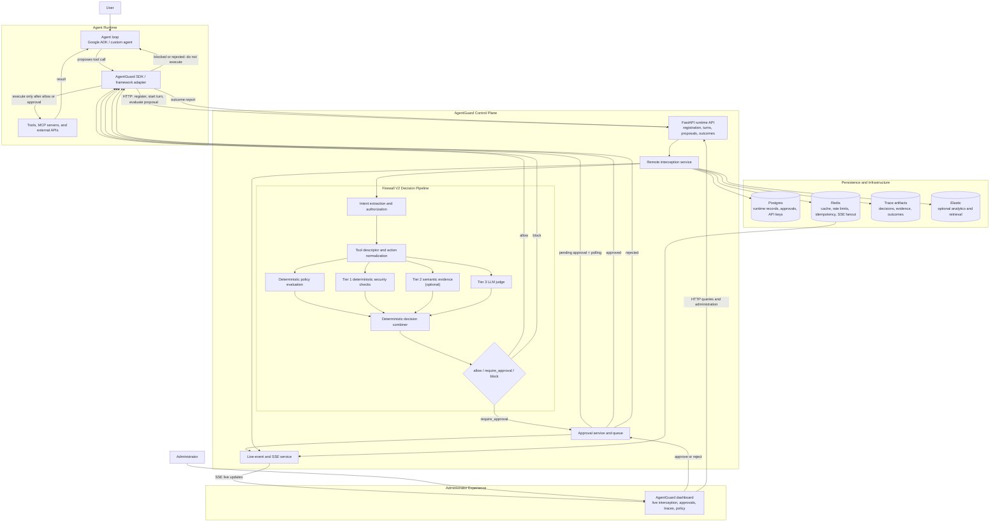

# AgentGuard

AgentGuard is an open-source runtime security and approval layer for tool-using AI agents. It intercepts proposed tool calls, evaluates them, and returns `allow`, `require_approval`, or `block` before the agent executes the tool.

## Architecture



## Quickstart

```bash
cp .env.local.example .env
docker compose --env-file .env up --build
```

Open:

- AgentGuard dashboard: http://127.0.0.1:5173
- API docs: http://127.0.0.1:8000/api/docs

Run the minimal SDK example:

```bash
python -m venv .venv
. .venv/bin/activate
pip install -e agentguard-product/packages/agentguard-sdk
AGENTGUARD_BASE_URL=http://127.0.0.1:8000 \
AGENTGUARD_API_KEY="$(grep '^AGENTGUARD_API_KEY=' .env | cut -d= -f2-)" \
python examples/minimal-python-agent/main.py
```

## Repository Layout

```text
agentguard-product/              AgentGuard API, dashboard, firewall, SDK, Helm chart
google-adk-personal-agent/       Google ADK example chatbot integration
examples/minimal-python-agent/   Minimal framework-neutral SDK example
docs/                            OSS user, architecture, deployment, and security docs
.github/workflows/               CI and publishing workflows
```

## Documentation

- [Quickstart](docs/quickstart.md)
- [Architecture](docs/architecture.md)
- [SDK Integration](docs/sdk-integration.md)
- [Approval Flow](docs/approval-flow.md)
- [Docker Compose Deployment](docs/deployment/docker-compose.md)
- [Kubernetes Deployment](docs/deployment/kubernetes.md)
- [Configuration](docs/configuration.md)
- [Security](docs/security.md)
- [Release Checklist](docs/release-checklist.md)
- [Contributing](CONTRIBUTING.md)

## Development Checks

```bash
make test
make build-dashboard
```

## License

AgentGuard is licensed under the [Apache License 2.0](LICENSE).

Copyright 2026 AgentGuard contributors. See [AUTHORS.md](AUTHORS.md)
and [NOTICE](NOTICE) for project attribution.

## Setup Google Workspace MCP

No Google Cloud project or OAuth credentials needed — the package ships with its own built-in OAuth client.

**Step 1 — Install Node.js 18+**

```bash
node --version   # must be 18+
```

**Step 2 — Authenticate once**

```bash
npx -y --package=github:gemini-cli-extensions/workspace#v0.0.8 \
  gemini-workspace-server --login
```

A browser window opens. Sign in with the Google account whose Calendar, Gmail, and Drive you want the agent to access. The token is stored locally and refreshed automatically.
