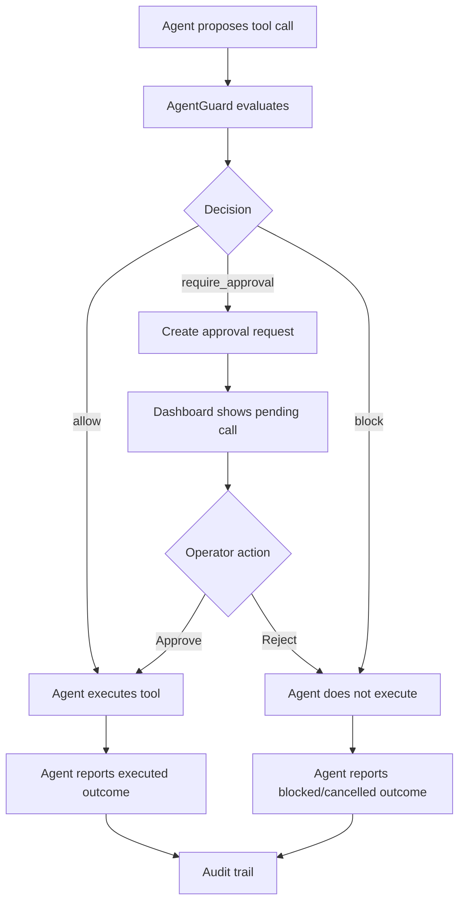

# Approval Flow

Approval is the core safety mechanism for actions that are useful but risky.

## Decision Types

| Decision | Tool execution | Typical reason |
|---|---|---|
| `allow` | Agent may execute immediately | Low risk or clearly aligned with user intent |
| `require_approval` | Agent must pause | Risky but potentially valid action |
| `block` | Agent must not execute | Violates policy or is too dangerous |

## End-to-End Flow



## What Operators See

The approval UI should help an operator answer:

- What did the user ask?
- What tool is the agent trying to call?
- What arguments will be sent?
- What is the normalized action?
- Which policies matched?
- What did Tier 1 / Tier 3 conclude?
- What happens if this is approved?

## Agent Responsibilities

The agent integration must enforce the result:

```python
if decision.decision == "allow":
    run_tool()
elif decision.decision == "require_approval":
    approval = guard.wait_for_approval(decision.approval_id)
    if approval.status == "approved":
        run_tool()
    else:
        do_not_execute()
else:
    do_not_execute()
```

## Important Security Rule

Approval is not a notification system. It is an execution gate.

The tool must not run until:

1. AgentGuard returns `allow`, or
2. AgentGuard returns `require_approval` and an operator approves.

