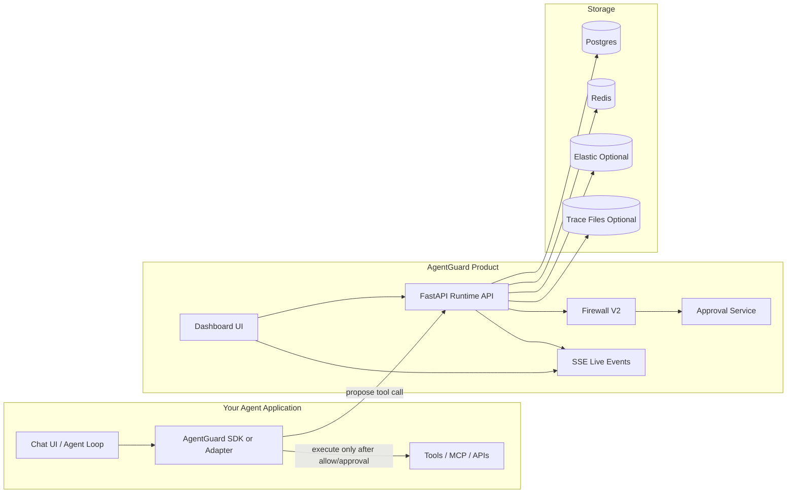
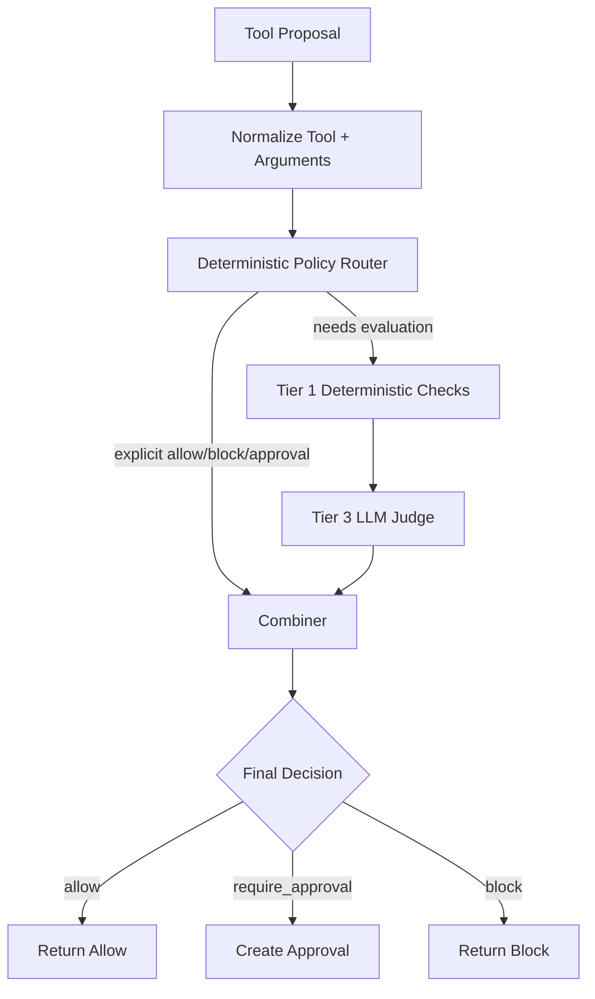

# Architecture

AgentGuard is a runtime governance layer. It does not replace your agent framework; it wraps the moment where an agent is about to execute a tool.

## High-Level System

## Runtime Path

1. User sends a message to the chatbot.
2. The agent decides it wants to call a tool.
3. The SDK/adapter sends a tool proposal to AgentGuard.
4. AgentGuard normalizes the action and evaluates it.
5. AgentGuard returns `allow`, `require_approval`, or `block`.
6. The agent enforces the result.
7. The agent reports the final outcome.

## Firewall V2

## Deterministic Policy

Deterministic rules are designed to be non-overridable. If a user or administrator sets a hard rule, Tier 3 cannot weaken it.

Examples:

- Never send payments above a configured threshold.
- Require approval for email sending.
- Block shell commands matching dangerous patterns.
- Require approval for external data writes.

## Tier 1

Tier 1 handles fast deterministic checks:

- known dangerous shell patterns
- tool criticality
- basic argument inspection
- policy compatibility
- risk flags from normalized metadata

Tier 1 is fast, explainable, and cheap.

## Tier 3 LLM Judge

Tier 3 handles ambiguous cases where semantic understanding matters:

- Does the tool call match the user’s actual intent?
- Is the action necessary?
- Are arguments scoped narrowly enough?
- Is the tool risky or irreversible?
- Is the sequence suspicious?
- Is there prompt-injection influence from untrusted context?

Tier 3 produces structured evidence. It does not directly execute tools and does not override deterministic hard blocks.

## Combiner

The combiner converts policy matches and tier evidence into a final decision.

It is intentionally deterministic:

- deterministic block wins
- explicit require-approval policy wins over LLM allow
- low confidence should escalate toward approval/block, not silent allow
- LLM-discovered criteria can escalate risk but should not strongly reduce risk

This keeps the LLM as an evaluator, not an authority.

## Persistence Model

| Store | Purpose |
|---|---|
| Postgres | Runtime records, approvals, API keys |
| Redis | Rate limits, idempotency, approval cache, SSE fanout |
| Local trace files | Simple local trace artifacts |
| Elastic | Optional analytics/search/retrieval-backed decisions |

## Why AgentGuard Is Separate From the Agent

AgentGuard is a product layer, not a chatbot implementation. This separation lets any team integrate it into:

- custom Python agents
- Google ADK agents
- LangChain or LlamaIndex agents
- internal agent frameworks
- hosted SaaS chatbots
- MCP-enabled assistants

