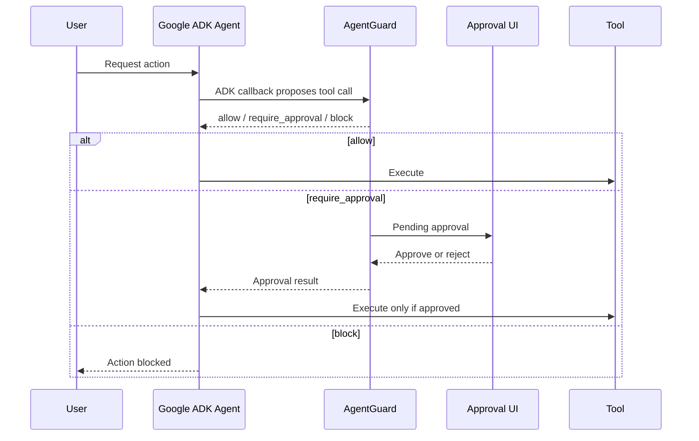

# Google ADK Integration

The Google ADK personal agent is an example of AgentGuard as a real governed runtime path.

## Responsibility Split

| Component | Responsibility |
|---|---|
| Google ADK agent | Chat loop, model calls, tools, MCP, execution |
| AgentGuard | Interception, policy, approvals, audit trail |

The ADK agent owns tool execution. AgentGuard decides whether execution is allowed.

## Environment Variables

In `google-adk-personal-agent/.env`:

```bash
GOOGLE_API_KEY=...
ADK_MODEL=gemini-3-flash-preview

AGENTGUARD_BASE_URL=http://127.0.0.1:8000
AGENTGUARD_API_KEY=...
AGENTGUARD_ENFORCE_APPROVAL=true
AGENTGUARD_APPROVAL_WAIT_TIMEOUT_SECONDS=60
```

The `AGENTGUARD_API_KEY` must match the key configured on the AgentGuard product.

## Runtime Flow



## MCP Tools

The ADK agent can load MCP tools from:

```bash
ADK_MCP_CONFIG_PATH=config/adk_mcp_servers.toml
```

AgentGuard should still see the proposed tool name and arguments before execution.

## Recommended Local Run

1. Start AgentGuard:

```bash
cp .env.local.example .env
docker compose --env-file .env up --build
```

2. Configure `google-adk-personal-agent/.env`.

3. Run the ADK app using the project’s ADK command or Docker profile.

## Common ADK Mistakes

| Problem | Result | Fix |
|---|---|---|
| Wrong `AGENTGUARD_API_KEY` | `401 Unauthorized` | Make both env files match |
| `AGENTGUARD_ENFORCE_APPROVAL=false` | Risky calls may not pause | Use `true` for real safety |
| Missing `GOOGLE_API_KEY` | Gemini calls fail | Create key in Google AI Studio |
| Tool metadata too vague | More conservative decisions | Set explicit `tool_type` or annotations |

