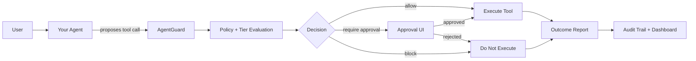

# AgentGuard Wiki

> Runtime security, approval, and auditability for tool-using AI agents.

AgentGuard sits between your AI agent and the tools it wants to execute. Before a tool runs, AgentGuard evaluates the proposed action, explains the risk, requests human approval when needed, and records an auditable trace.

## Why AgentGuard Exists

Modern agents can send emails, update calendars, read files, execute shell commands, call payment APIs, and interact with internal systems. Those actions are useful, but risky when the model misunderstands intent, follows malicious tool output, or overreaches.

AgentGuard provides a production-ready control plane for:

- **Pre-execution interception**: tools are checked before they run.
- **Human approval**: risky actions can pause until an operator approves.
- **Deterministic policy**: non-overridable rules for explicit safety constraints.
- **Tiered evaluation**: deterministic checks plus LLM judge evaluation for ambiguous actions.
- **Auditable evidence**: every decision includes matched rules, normalized action, tier evidence, and outcome.
- **Framework portability**: use the REST API, Python SDK, decorators, or Google ADK adapter.

## Start Here

| Goal | Page |
|---|---|
| Run AgentGuard locally | [Quickstart](Quickstart.md) |
| Understand the architecture | [Architecture](Architecture.md) |
| Add AgentGuard to your chatbot | [Integration Guide](Integration-Guide.md) |
| Use the simple Python SDK | [Simple SDK Integration](Simple-SDK-Integration.md) |
| Protect a Google ADK agent | [Google ADK Integration](Google-ADK-Integration.md) |
| Understand approvals | [Approval Flow](Approval-Flow.md) |
| Deploy with Docker or Kubernetes | [Deployment](Deployment.md) |
| Configure production secrets | [Configuration](Configuration.md) |
| Operate it safely | [Security & Operations](Security-and-Operations.md) |
| Debug common issues | [Troubleshooting](Troubleshooting.md) |

## Integration Options

| Integration style | Best for | Developer experience |
|---|---|---|
| **One-call API** | Any language or framework | `POST /api/v2/guard/check` |
| **Python SDK** | Python chatbots | `AgentGuard.check(...)` |
| **Decorator API** | Wrapping Python tool functions | `@guard.tool(tool_type="email.send")` |
| **Google ADK adapter** | Google ADK agents | ADK callbacks intercept tool calls |
| **Low-level runtime API** | Custom framework adapters | register agent, start turn, evaluate tool, report outcome |

## Current Product Shape

AgentGuard is split into two deployable apps:

- **AgentGuard Product**: API, dashboard, approval UI, policy engine, SDK packages, persistence, Docker, Helm.
- **Google ADK Personal Agent**: example chatbot app that uses AgentGuard as its governed runtime layer.

This separation is intentional: AgentGuard should be reusable by any chatbot, not tightly coupled to one demo agent.

## Production Principles

- The agent must never execute a tool before AgentGuard returns `allow` or approval resolves.
- Deterministic policy blocks must be non-overridable.
- LLM judge output is advisory evidence; final decisions are made by the combiner/enforcer.
- Production deployments should use real Postgres, password-protected Redis, strong API keys, TLS, and disabled public API docs.
- Real `.env` files should never be committed.

