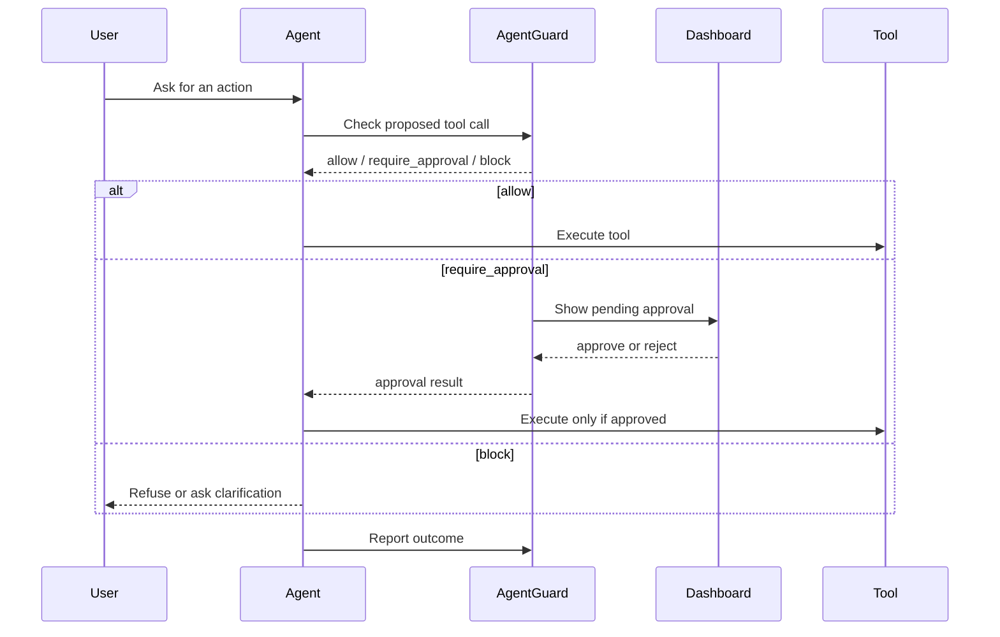

# Quickstart

This guide gets AgentGuard running locally with Docker Compose and verifies a real guarded tool-call flow.

## Prerequisites

- Docker Desktop or Docker Engine with Compose
- Python 3.11+ if you want to run the SDK example locally
- Optional: a Gemini API key for LLM-backed intent and Tier 3 evaluation

## 1. Start AgentGuard

From the repository root:

```bash
cp .env.local.example .env
docker compose --env-file .env up --build
```

Open:

- **AgentGuard dashboard**: `http://127.0.0.1:5173`
- **API docs**: `http://127.0.0.1:8000/api/docs`
- **Health check**: `http://127.0.0.1:8000/api/v1/health`

## 2. Confirm Your API Key

The local key lives in `.env`:

```bash
grep '^AGENTGUARD_API_KEY=' .env
```

The same key must be used by any agent or SDK client calling AgentGuard.

## 3. Run the Minimal Python Agent

```bash
python -m venv .venv
. .venv/bin/activate
pip install -e agentguard-product/packages/agentguard-sdk

AGENTGUARD_BASE_URL=http://127.0.0.1:8000 \
AGENTGUARD_API_KEY="$(grep '^AGENTGUARD_API_KEY=' .env | cut -d= -f2-)" \
python examples/minimal-python-agent/main.py
```

If AgentGuard returns `require_approval`, open the dashboard and approve or reject the pending tool call.

## 4. Expected Runtime Flow



## 5. Stop the Stack

```bash
docker compose down
```

Use `docker compose down -v` only when you want to delete local Postgres and Redis data.

## Common First-Run Issues

| Symptom | Likely cause | Fix |
|---|---|---|
| Dashboard says API is offline | API container is not healthy yet | Run `docker compose ps` and check API logs |
| `401 Unauthorized` | Missing or mismatched API key | Make the agent key match AgentGuard key |
| Redis auth error | Redis URL lacks password | Use `redis://:password@redis:6379/0` |
| Production startup fails | Weak/default secrets | Generate strong secrets and set real web origin |

